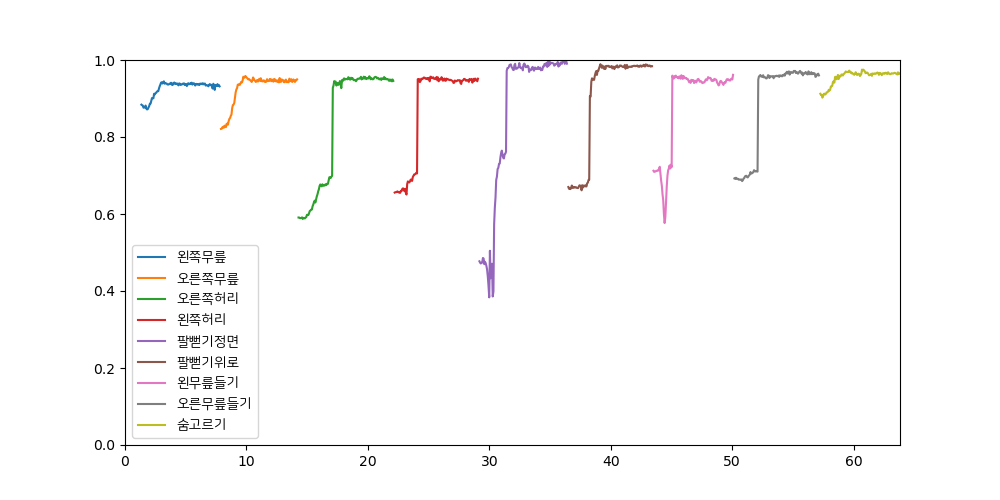

Pose Detector
===

[OpenPose](https://github.com/CMU-Perceptual-Computing-Lab/openpose) 기반의 포즈 인식, 준비운동 스트레칭 인터랙션 컨텐츠.

<p align="center">
    
    <br>
    <sup>애플리케이션 실행 화면. 좌측 : 목표 포즈, 우측 : 카메라 피드 + 키포인트 렌더링</sup>
</p>
    
<p align="center">
    
    <br>
    <sup>결과 리포트. x축 : 시간(초), y축 : 자세 매칭 스코어</sup>
</p>

## Prerequisites
- OpenPose (https://github.com/CMU-Perceptual-Computing-Lab/openpose)
- FFmpeg

## Usage

**1. Install pip packages**
```shell
pip install -r requirements.txt
```

**2. Run the application**

```plaintext
> python app.py --help
usage: app.py [-h] [--input-api INPUT_API] [--input-device INPUT_DEVICE]
              [--video-width VIDEO_WIDTH] [--video-height VIDEO_HEIGHT] [-f]
              [-n] [--fail-tolerance FAIL_TOLERANCE] --op-path OP_PATH
              session_id

positional arguments:
  session_id

optional arguments:
  -h, --help            show this help message and exit
  --input-api INPUT_API
                        preferred Capture API backends to use. (default:
                        CAP_DSHOW)
  --input-device INPUT_DEVICE
                        id of the video capturing device to open. (default: 0)
  --video-width VIDEO_WIDTH
                        width of the frames in the video stream. (default:
                        1280)
  --video-height VIDEO_HEIGHT
                        height of the frames in the video stream. (default:
                        720)
  -f, --fullscreen      run the app in full screen mode. (default: False)
  -n, --no-save         do not save the session. (default: False)
  --fail-tolerance FAIL_TOLERANCE
                        consecutive count to be evaluated as a failure.
                        (default: 5)
  --op-path OP_PATH     OpenPose build path (default: None)
```

## Examples

**app.py**
```shell
python app.py 20 --input-device 1 -f --op-path "D:/projects/openpose-1.5.0/build"
```
- 20 : 세션 id. 세션은 `records/{세션_id}/{타임스탬프}/` 경로에 저장.
- --input-device 1 : `cv.VideoCapture()`에 전달될 인수. 기본 api로 DirectShow 사용.
- -f : 풀스크린으로 실행.
- --op-path "path" : OpenPose 빌드 경로.

**generate_report.py**
```shell
python generate_report.py records/20/1605249626/data.pkl
```
저장된 세션 데이터(.pkl)의 경로를 positional argument로 전달.

**Acknowledgement**
> 본 연구는 문화체육관광부 및 한국콘텐츠진흥원의 연구개발지원사업으로 수행되었음(과제번호: R2019020008)